# 🏥 병원 예약 & 내부 업무 시스템 — 화면 흐름 시퀀스 다이어그램

> **문서 버전:** v4.0 (v4.2 계획서 + API spec v4.0 기반)
> **작성일:** 2026년
> **변경 이력:** v2.0 → v3.0 — 전 ROLE 대시보드 추가 / SSR PRG 패턴 반영 / 방문 접수 흐름 추가 / 챗봇 이력 저장 반영 / URL 전면 정정
> v3.0 → v4.0 — ERD v3.0 정합: CHATBOT_HISTORY 테이블 반영, RESERVATION.source 컬럼 반영, API 명세서 v4.0 연동
> **연관 문서:** 프로젝트 계획서 v4.2 / ERD v3.0 / 화면 정의서 v2.0 / API 명세서 v4.0
> **기준:** Spring Boot SSR (Mustache) + PRG (Post-Redirect-Get) 패턴 + RPC 스타일 URL

---

## 목차

1. [외부 사용자 — LLM 증상 추천 예약 흐름](#1-외부-사용자--llm-증상-추천-예약-흐름)
2. [외부 사용자 — 직접 선택 예약 흐름](#2-외부-사용자--직접-선택-예약-흐름)
3. [접수 직원 — 로그인·대시보드·접수 처리 흐름](#3-접수-직원--로그인대시보드접수-처리-흐름-role_staff)
4. [접수 직원 — 방문 접수 흐름](#4-접수-직원--방문-접수-흐름-role_staff)
5. [의사 — 로그인·대시보드·진료 처리 흐름](#5-의사--로그인대시보드진료-처리-흐름-role_doctor)
6. [간호사 — 로그인·대시보드·업무 조회 흐름](#6-간호사--로그인대시보드업무-조회-흐름-role_nurse)
7. [의사·간호사 — 병원 규칙 Q&A 챗봇 흐름](#7-의사간호사--병원-규칙-qa-챗봇-흐름)
8. [관리자 — 로그인·대시보드·예약 관리 흐름](#8-관리자--로그인대시보드예약-관리-흐름-role_admin)
9. [관리자 — 병원 규칙 관리 흐름](#9-관리자--병원-규칙-관리-흐름-role_admin)
10. [관리자 — 인사·물품 관리 흐름](#10-관리자--인사물품-관리-흐름-role_admin)
11. [전체 상태 흐름 다이어그램](#11-전체-상태-흐름-다이어그램)
12. [권한 기반 화면 흐름 요약](#12-권한-기반-화면-흐름-요약)
13. [SSR PRG 패턴 상세](#13-ssr-prg-패턴-상세)
14. [LLM 연동 흐름 상세](#14-llm-연동-흐름-상세)

---

## 1. 외부 사용자 — LLM 증상 추천 예약 흐름

### 🎯 목적

비회원 환자가 증상 텍스트를 입력하면 LLM이 진료과·의사·시간을 추천하고, 환자가 확인 후 예약을 확정한다.

### 📌 주요 상태 변화

| 단계            | 상태                          |
| --------------- | ----------------------------- |
| 예약 확정 시    | `RESERVED` 생성               |
| 중복 예약 시    | 오류 — 폼 재렌더링, 저장 없음 |
| LLM API 실패 시 | 직접 선택 화면으로 폴백       |

### 🔄 시퀀스 다이어그램

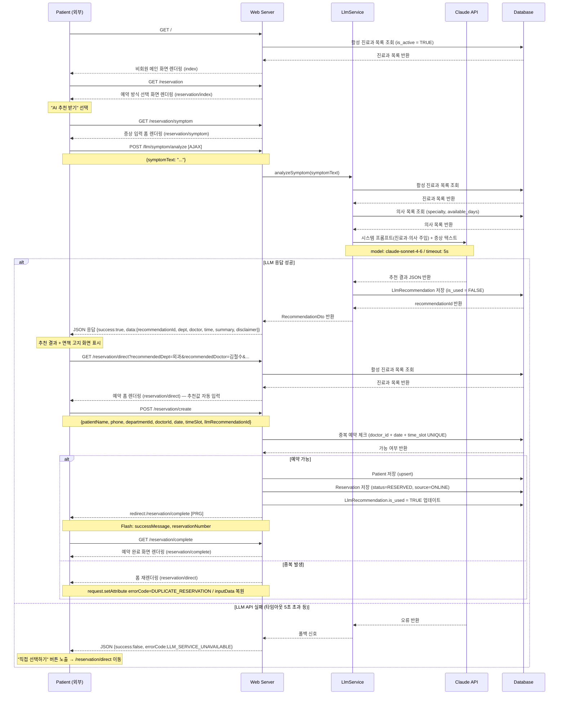

### 📝 흐름 설명

1. **비회원 메인** : `/`에서 활성 진료과 안내 → 예약 방식 선택 화면으로 이동.
2. **LLM 호출** : AJAX POST → JSON 응답. `LlmService`가 DB에서 진료과·의사를 조회한 뒤 Claude API 프롬프트에 주입.
3. **추천 결과** : `recommendationId` 포함 응답. 예약 확정 시 `llmRecommendationId`로 전달 → `is_used = TRUE` 업데이트.
4. **예약 확정** : PRG 패턴. `POST /reservation/create` 성공 시 `redirect:/reservation/complete` + Flash Attribute. Reservation 저장 시 `source=ONLINE` 설정.
5. **오류 처리** : 중복 예약 시 `reservation/direct` 폼 재렌더링 + 입력값 복원.
6. **면책 고지** : 추천 결과 화면에 `disclaimer` 문구 필수 표시.

---

## 2. 외부 사용자 — 직접 선택 예약 흐름

### 🎯 목적

LLM 추천 없이 환자가 진료과·의사·시간을 직접 선택하여 예약한다. AI 추천 흐름의 폴백 경로이기도 하다.

### 📌 주요 상태 변화

| 단계                   | 상태                          |
| ---------------------- | ----------------------------- |
| 예약 정보 제출 후 저장 | `RESERVED` 생성               |
| 중복 예약 시           | 오류 — 폼 재렌더링, 저장 없음 |

### 🔄 시퀀스 다이어그램

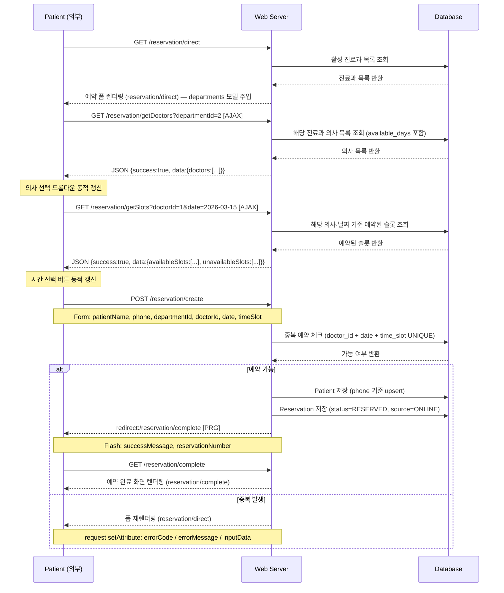

### 📝 흐름 설명

1. **진료과 선택** : `is_active = TRUE`인 진료과 목록만 표시.
2. **의사 조회 (AJAX)** : `GET /reservation/getDoctors` — 진료과 선택 시 동적 갱신.
3. **시간 슬롯 조회 (AJAX)** : `GET /reservation/getSlots` — 의사·날짜 선택 시 동적 갱신. 이미 예약된 슬롯 비활성화.
4. **예약 생성** : PRG 패턴. 성공 → redirect + Flash. 실패 → 폼 재렌더링 + `inputData` 복원. Reservation 저장 시 `source=ONLINE` 설정.

---

## 3. 접수 직원 — 로그인·대시보드·접수 처리 흐름 (ROLE_STAFF)

### 🎯 목적

예약된 환자가 실제 방문하면 접수 처리하여 상태를 `RECEIVED`로 변경하고, 추가 정보를 입력한다.

### 📌 주요 상태 변화

| 이전 상태  | 이후 상태  | 처리 주체    |
| ---------- | ---------- | ------------ |
| `RESERVED` | `RECEIVED` | `ROLE_STAFF` |

### 🔄 시퀀스 다이어그램

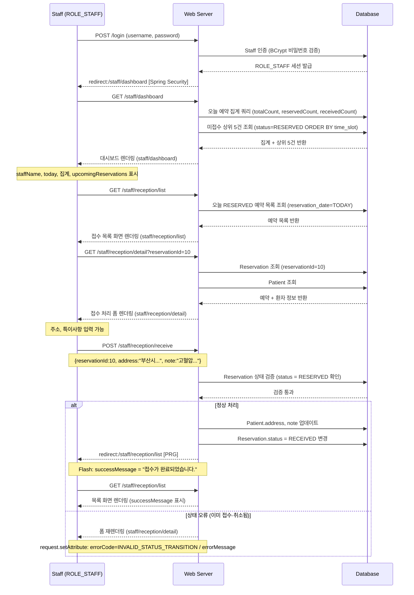

### 📝 흐름 설명

1. **로그인 → 대시보드** : 로그인 성공 시 `/staff/dashboard` 자동 이동. 오늘 예약 현황 한눈에 파악.
2. **접수 목록** : 당일 `RESERVED` 상태만 필터링. 이미 접수된 환자는 구분 표시.
3. **접수 처리** : 주소·특이사항 입력 후 `RECEIVED` 상태 변경. PRG 패턴으로 중복 제출 방지.
4. **오류 처리** : 상태 검증 실패 시 폼 재렌더링. 다른 직원이 먼저 처리한 경우 포함.

---

## 3-1. 접수 직원 — 전화 예약 등록 흐름 (ROLE_STAFF)

### 🎯 목적

환자가 전화로 예약을 요청하면 접수 직원이 대신 예약을 등록한다.

### 📌 주요 상태 변화

| 단계           | 상태            | 특이사항     |
| -------------- | --------------- | ------------ |
| 전화 예약 등록 | `RESERVED` 생성 | source=PHONE |

### 🔄 시퀀스 다이어그램

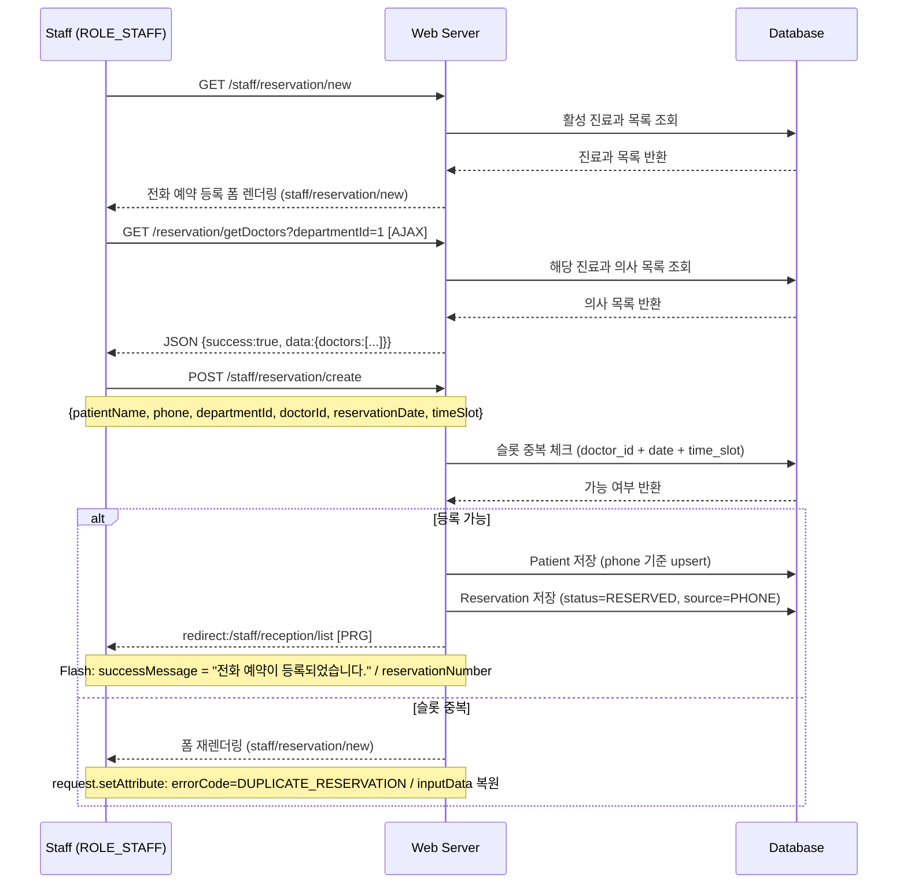

### 📝 흐름 설명

1. **전화 예약 특성** : 접수 직원이 환자 정보를 대신 입력. `source=PHONE`으로 저장하여 온라인 예약과 구분.
2. **예약 상태** : `RESERVED` 상태로 생성. 이후 환자 방문 시 접수 처리 흐름으로 진행.
3. **PRG 패턴** : 등록 성공 시 접수 목록으로 redirect.

---

## 4. 접수 직원 — 방문 접수 흐름 (ROLE_STAFF)

### 🎯 목적

사전 예약 없이 병원에 직접 방문한 환자를 즉시 접수 처리한다. 예약 생성과 접수가 동시에 이루어진다.

### 📌 주요 상태 변화

| 단계                | 상태            | 특이사항                               |
| ------------------- | --------------- | -------------------------------------- |
| 방문 접수 등록 즉시 | `RECEIVED` 직행 | `RESERVED` 단계 없음                   |
| source 구분         | `WALKIN`        | 온라인(`ONLINE`), 전화(`PHONE`)와 구분 |

### 🔄 시퀀스 다이어그램

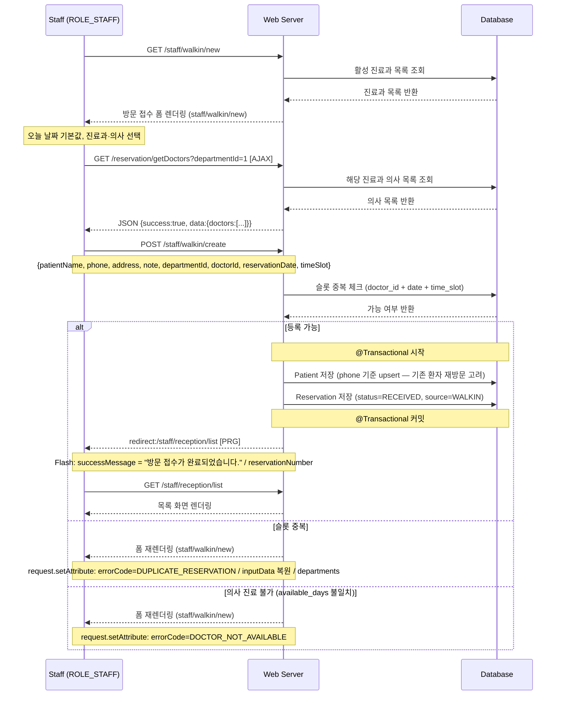

### 📝 흐름 설명

1. **방문 접수 특성** : 사전 예약 없이 `RECEIVED` 상태로 직행. 접수 처리 단계 생략.
2. **트랜잭션** : `Patient` 저장과 `Reservation` 저장을 `@Transactional`로 묶음. 중간 실패 시 전체 롤백.
3. **환자 중복 처리** : 같은 연락처 환자가 재방문하는 경우 기존 `Patient` 레코드를 재사용 (upsert).
4. **source 구분** : `source = WALKIN`으로 저장. 관리자 `/admin/reception/list`에서 예약 유형 구분 표시.

---

## 5. 의사 — 로그인·대시보드·진료 처리 흐름 (ROLE_DOCTOR)

### 🎯 목적

접수 완료된 환자를 진료하고 기록을 작성하여 진료를 완료 처리한다.

### 📌 주요 상태 변화

| 이전 상태  | 이후 상태   | 처리 주체     |
| ---------- | ----------- | ------------- |
| `RECEIVED` | `COMPLETED` | `ROLE_DOCTOR` |

### 🔄 시퀀스 다이어그램

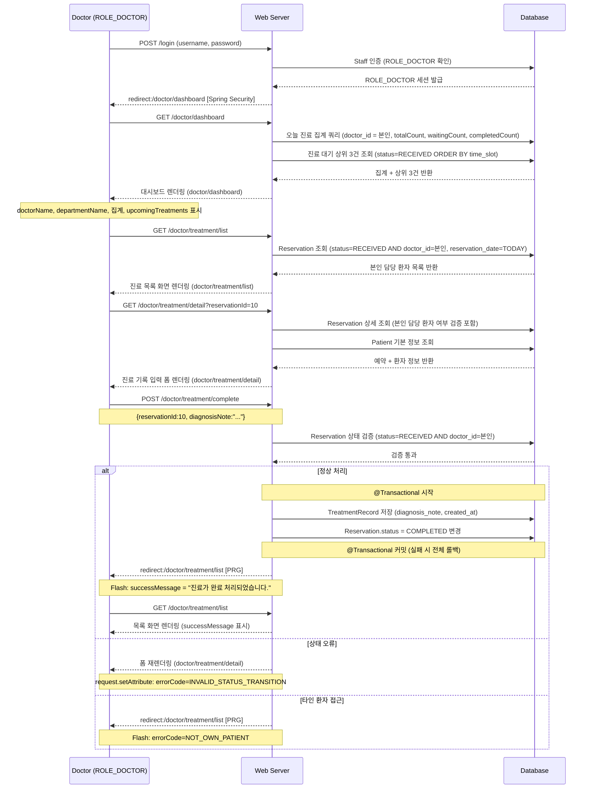

### 📝 흐름 설명

1. **로그인 → 대시보드** : 로그인 성공 시 `/doctor/dashboard` 자동 이동. 본인 오늘 진료 집계 표시.
2. **본인 담당 환자 필터링** : `doctor_id = 로그인 의사 ID` 조건. 다른 의사 환자 노출 없음.
3. **트랜잭션 묶음** : `TreatmentRecord` 저장 + `Reservation.status = COMPLETED` 변경은 반드시 `@Transactional` 하나로 처리.
4. **PRG 패턴** : 완료 후 목록 화면으로 리다이렉트. 새로고침 시 중복 POST 방지.

---

## 6. 간호사 — 로그인·대시보드·업무 조회 흐름 (ROLE_NURSE)

### 🎯 목적

당일 예약 현황과 접수 상태를 확인하고, 필요 시 환자 기본 정보를 수정한다.

### 📌 주요 상태 변화

> 간호사는 예약 상태 변경 권한 없음. 조회 및 환자 정보 수정만 가능.

### 🔄 시퀀스 다이어그램

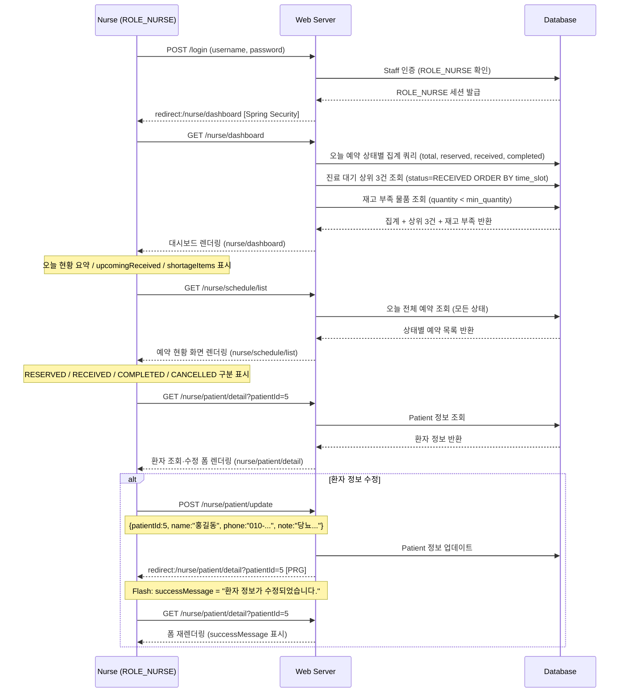

### 📝 흐름 설명

1. **로그인 → 대시보드** : 로그인 성공 시 `/nurse/dashboard` 자동 이동. 오늘 현황 + 재고 부족 알림 표시.
2. **현황 조회** : 당일 전체 상태별 예약 목록. `ROLE_STAFF`와 달리 모든 상태 조회 (읽기 전용).
3. **환자 정보 수정** : 이름·연락처·특이사항 수정 가능. 예약 상태 변경 권한 없음.
4. **PRG 패턴** : 수정 후 동일 상세 화면으로 리다이렉트 + Flash 성공 메시지.

---

## 7. 의사·간호사 — 병원 규칙 Q&A 챗봇 흐름

### 🎯 목적

`ROLE_DOCTOR` · `ROLE_NURSE`가 업무 화면에서 병원 규칙, 처리 절차, 물품 위치 등을 질문하면 LLM이 등록된 규칙 문서 기반으로 답변한다. 대화 이력은 세션 단위로 저장된다.

### 📌 LLM 동작 방식

- 관리자가 등록한 `HOSPITAL_RULE` 테이블의 텍스트를 시스템 프롬프트에 주입
- 등록된 규칙 범위 내에서만 답변 / 범위 외 질문은 "확인 불가" 응답
- 대화 이력 저장: `CHATBOT_HISTORY` 테이블에 `session_id`, `staff_id`, `question`, `answer`, `created_at` 컬럼으로 저장

### 🔄 시퀀스 다이어그램

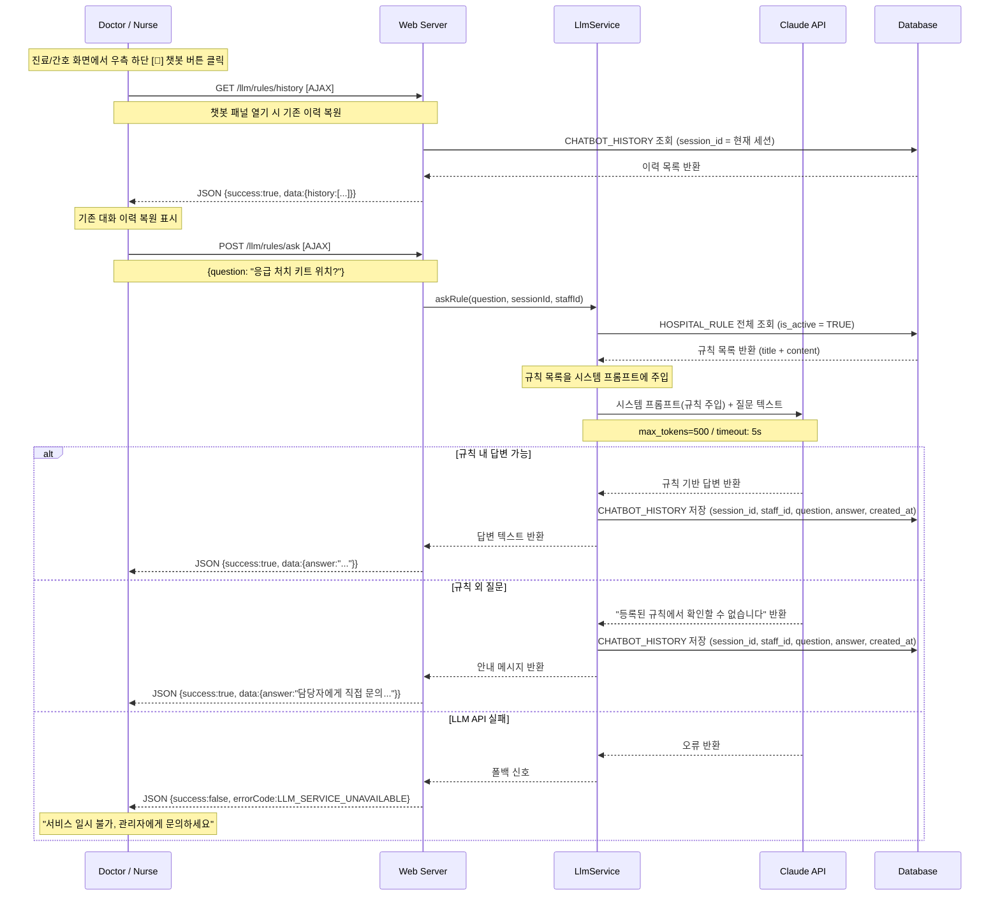

### 📝 흐름 설명

1. **챗봇 진입** : 화면 우측 하단 [💬] 고정 버튼. 업무 화면 이탈 없이 사용.
2. **이력 복원** : 오버레이 열기 시 `GET /llm/rules/history` AJAX 호출로 기존 대화 이력 복원.
3. **규칙 주입** : 매 요청마다 `is_active = TRUE` 규칙 전체 조회 → 시스템 프롬프트 동적 구성. 관리자 규칙 수정 시 다음 요청부터 즉시 반영.
4. **이력 저장** : 성공·범위 외 답변 모두 `CHATBOT_HISTORY` 테이블에 `session_id`, `staff_id`, `question`, `answer`, `created_at` 컬럼으로 저장. API 실패 시 저장 생략.

---

## 8. 관리자 — 로그인·대시보드·예약 관리 흐름 (ROLE_ADMIN)

### 🎯 목적

전체 예약·접수 현황을 조회하고 상태를 관리(취소 처리 등)한다.

### 📌 주요 상태 변화

| 단계      | 설명                                                 |
| --------- | ---------------------------------------------------- |
| 예약 취소 | `COMPLETED` 제외 모든 상태에서 `CANCELLED` 처리 가능 |

### 🔄 시퀀스 다이어그램

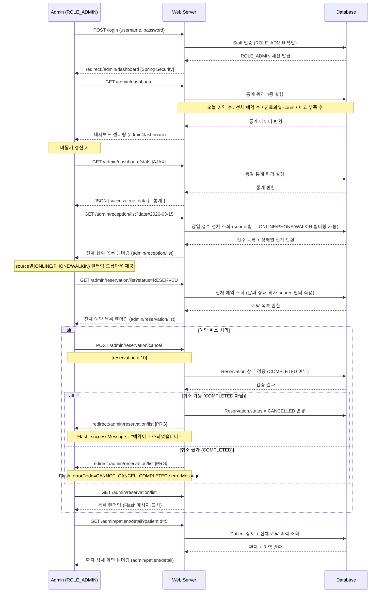

### 📝 흐름 설명

1. **로그인 → 대시보드** : 로그인 성공 시 `/admin/dashboard` 자동 이동.
2. **전체 접수 목록** : `/admin/reception/list` — 날짜·진료과·상태·예약 구분(ONLINE/PHONE/WALKIN) 필터. source별 필터링 드롭다운을 통해 예약 유입 경로 구분 조회 가능.
3. **대시보드 AJAX 갱신** : `GET /admin/dashboard/stats`로 통계 데이터를 비동기 갱신 가능.
4. **취소 PRG** : 취소 성공·실패 모두 목록 화면으로 redirect + Flash Attribute.

---

## 9. 관리자 — 병원 규칙 관리 흐름 (ROLE_ADMIN)

### 🎯 목적

챗봇이 참조하는 병원 규칙 문서를 등록·수정·삭제한다. 변경 즉시 챗봇에 반영된다.

### 🔄 시퀀스 다이어그램

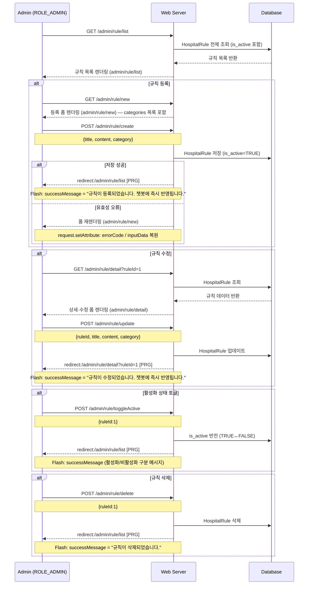

### 📝 흐름 설명

1. **등록·수정 화면 분리** : 등록은 `/admin/rule/new`, 상세·수정은 `/admin/rule/detail`. 등록 폼과 수정 폼이 별도 화면.
2. **즉시 반영** : 수정·추가 후 다음 챗봇 요청부터 바로 반영. 별도 캐시 무효화 불필요 (매 요청마다 DB 조회).
3. **비활성화** : `is_active = FALSE` → 챗봇 프롬프트에서 제외. 규칙 데이터는 보존.
4. **전체 PRG** : 모든 POST 처리 후 redirect. 새로고침 중복 제출 방지.

---

## 10. 관리자 — 인사·물품 관리 흐름 (ROLE_ADMIN)

### 🎯 목적

직원·의사 등록 및 물품 재고를 관리한다.

### 🔄 시퀀스 다이어그램

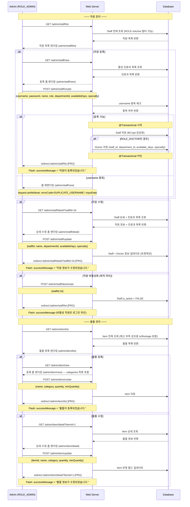

### 📝 흐름 설명

1. **직원 등록 트랜잭션** : `ROLE_DOCTOR`인 경우 `Staff` + `Doctor` 레코드를 `@Transactional`로 동시 저장.
2. **퇴직 처리** : 삭제 대신 `is_active = FALSE`. 기존 예약 이력 보존. 비활성 직원은 Spring Security 레벨에서 로그인 차단.
3. **물품 등록·수정 화면 분리** : `/admin/item/new` (등록), `/admin/item/detail` (수정). v2.1 신규.
4. **물품 update** : v2.0의 `updateQuantity` (수량만) → v3.0의 `update` (전체 필드). API spec v4.0과 동기화.

---

## 11. 전체 상태 흐름 다이어그램

### 🎯 목적

예약 생성부터 완료/취소까지 전체 생명주기와 각 전환의 담당 주체를 한눈에 파악한다.

### 🔄 상태 다이어그램

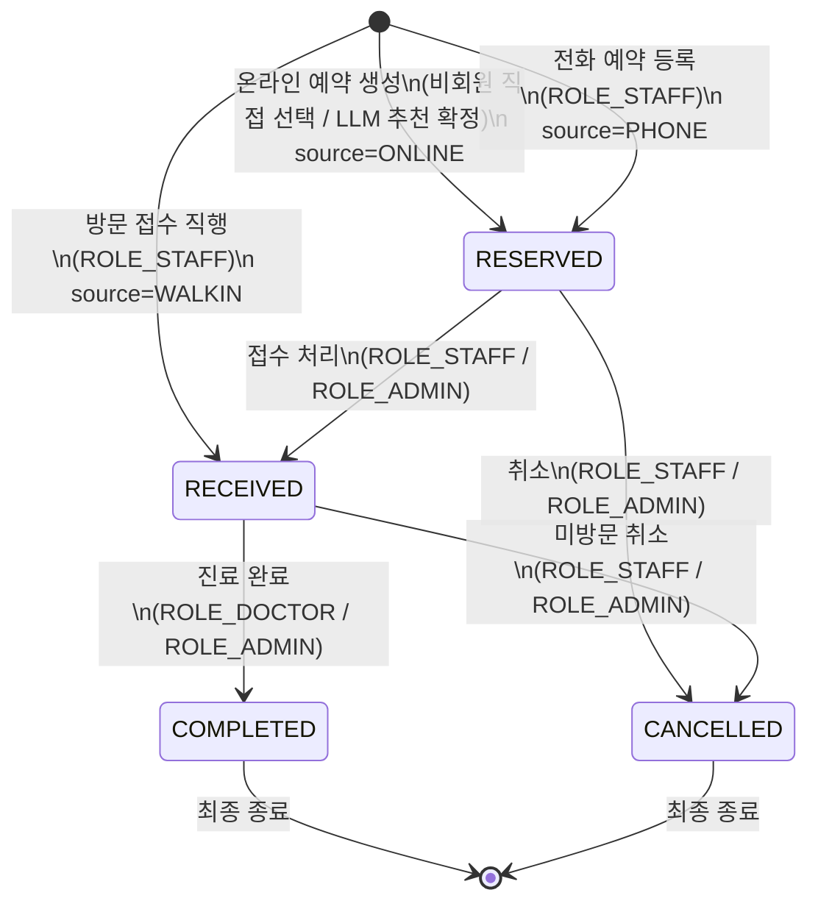

### 📝 상태별 전환 규칙

| 현재 상태   | 다음 상태   | 전환 주체                   | 역방향  |
| ----------- | ----------- | --------------------------- | ------- |
| `[시작]`    | `RESERVED`  | 비회원, ROLE_STAFF          | —       |
| `[시작]`    | `RECEIVED`  | ROLE_STAFF (방문 접수만)    | —       |
| `RESERVED`  | `RECEIVED`  | `ROLE_STAFF`, `ROLE_ADMIN`  | ❌      |
| `RESERVED`  | `CANCELLED` | `ROLE_STAFF`, `ROLE_ADMIN`  | ❌      |
| `RECEIVED`  | `COMPLETED` | `ROLE_DOCTOR`, `ROLE_ADMIN` | ❌      |
| `RECEIVED`  | `CANCELLED` | `ROLE_STAFF`, `ROLE_ADMIN`  | ❌      |
| `COMPLETED` | 없음        | —                           | ❌ 최종 |
| `CANCELLED` | 없음        | —                           | ❌ 최종 |

> ⚠️ **Service 레이어 검증 필수:** 상태 전이는 화면 버튼 제어만으로 막지 않고, 반드시 Service 레이어에서 이전 상태를 검증한다. 잘못된 상태 변경 시 `INVALID_STATUS_TRANSITION` 예외 발생.

---

## 12. 권한 기반 화면 흐름 요약

### 🗺️ 역할별 전체 화면 진입 경로 (v4.0 URL 기준)

```
[외부 — 비회원 환자]
└── GET /                           비회원 메인 (진료과 안내)
└── GET /reservation                예약 방식 선택
    ├── GET /reservation/symptom    증상 입력
    │   └── POST /llm/symptom/analyze  [AJAX] LLM 추천
    │       └── GET /reservation/direct?recommended...  예약 폼 (추천값 자동 입력)
    │           └── POST /reservation/create → redirect:/reservation/complete
    └── GET /reservation/direct     직접 선택 예약 폼
        └── POST /reservation/create → redirect:/reservation/complete

[ROLE_STAFF — 접수 직원]
└── POST /login → redirect:/staff/dashboard
    └── GET /staff/dashboard            대시보드
    └── GET /staff/reception/list       오늘 접수 목록
        └── GET /staff/reception/detail  접수 처리 폼
            └── POST /staff/reception/receive → redirect:/staff/reception/list
    └── GET /staff/reservation/new      전화 예약 등록 폼 (source=PHONE)
        └── POST /staff/reservation/create → redirect:/staff/reception/list
    └── GET /staff/walkin/new           방문 접수 폼 (source=WALKIN)
        └── POST /staff/walkin/create → redirect:/staff/reception/list

[ROLE_DOCTOR — 의사]
└── POST /login → redirect:/doctor/dashboard
    └── GET /doctor/dashboard           대시보드
    └── GET /doctor/treatment/list      오늘 진료 목록
        └── GET /doctor/treatment/detail  진료 기록 입력 폼
            └── POST /doctor/treatment/complete → redirect:/doctor/treatment/list
    └── [💬] POST /llm/rules/ask  [AJAX]   병원 규칙 챗봇
    └── [💬] GET /llm/rules/history  [AJAX] 챗봇 이력 조회

[ROLE_NURSE — 간호사]
└── POST /login → redirect:/nurse/dashboard
    └── GET /nurse/dashboard            대시보드 (재고 부족 알림 포함)
    └── GET /nurse/schedule/list        오늘 예약·접수 현황
    └── GET /nurse/patient/detail       환자 정보 조회·수정 폼
        └── POST /nurse/patient/update → redirect:/nurse/patient/detail
    └── [💬] POST /llm/rules/ask  [AJAX]   병원 규칙 챗봇
    └── [💬] GET /llm/rules/history  [AJAX] 챗봇 이력 조회

[ROLE_ADMIN — 관리자]
└── POST /login → redirect:/admin/dashboard
    └── GET /admin/dashboard            통계 대시보드
    └── GET /admin/reception/list       전체 접수 목록 (ONLINE/PHONE/WALKIN source별 필터링)
    └── GET /admin/reservation/list     전체 예약 조회 (source별 필터링 가능)
        └── POST /admin/reservation/cancel → redirect:/admin/reservation/list
    └── GET /admin/patient/list         환자 목록
        └── GET /admin/patient/detail   환자 상세·이력
    └── GET /admin/staff/list           직원 목록
        └── GET /admin/staff/new → POST /admin/staff/create
        └── GET /admin/staff/detail → POST /admin/staff/update
        └── POST /admin/staff/deactivate
    └── GET /admin/department/list      진료과 목록
        └── POST /admin/department/create (인라인 폼)
        └── GET /admin/department/detail → POST /admin/department/update
        └── POST /admin/department/deactivate / activate
    └── GET /admin/item/list            물품 목록
        └── GET /admin/item/new → POST /admin/item/create
        └── GET /admin/item/detail → POST /admin/item/update
        └── POST /admin/item/delete
    └── GET /admin/rule/list            병원 규칙 목록
        └── GET /admin/rule/new → POST /admin/rule/create
        └── GET /admin/rule/detail → POST /admin/rule/update
        └── POST /admin/rule/toggleActive / delete
```

### 📊 권한별 기능 접근 매트릭스

| 기능                                                      | 비회원 |   STAFF    |  DOCTOR   | NURSE | ADMIN |
| --------------------------------------------------------- | :----: | :--------: | :-------: | :---: | :---: |
| LLM 증상 추천 예약                                        |   ✅   |     ❌     |    ❌     |  ❌   |  ❌   |
| 직접 선택 예약                                            |   ✅   |     ❌     |    ❌     |  ❌   |  ❌   |
| 역할별 대시보드                                           |   ❌   |     ✅     |    ✅     |  ✅   |  ✅   |
| 오늘 예약 목록 조회                                       |   ❌   |     ✅     | ✅ 본인만 |  ✅   |  ✅   |
| 접수 처리 (RESERVED→RECEIVED)                             |   ❌   |     ✅     |    ❌     |  ❌   |  ✅   |
| **방문 접수 (즉시 RECEIVED)**                             |   ❌   |     ✅     |    ❌     |  ❌   |  ✅   |
| 전화 예약 등록                                            |   ❌   |     ✅     |    ❌     |  ❌   |  ✅   |
| 진료 기록 입력 (RECEIVED→COMPLETED)                       |   ❌   |     ❌     | ✅ 본인만 |  ❌   |  ✅   |
| 예약 취소                                                 |   ❌   |     ✅     |    ❌     |  ❌   |  ✅   |
| 환자 정보 수정                                            |   ❌   | ✅ 접수 시 |    ❌     |  ✅   |  ✅   |
| **병원 규칙 Q&A 챗봇**                                    |   ❌   |     ❌     |    ✅     |  ✅   |  ❌   |
| **챗봇 이력 조회**                                        |   ❌   |     ❌     |    ✅     |  ✅   |  ❌   |
| 전체 예약 조회 (전 기간)                                  |   ❌   |     ❌     |    ❌     |  ❌   |  ✅   |
| **전체 접수 현황 (source별 필터링: ONLINE/PHONE/WALKIN)** |   ❌   |     ❌     |    ❌     |  ❌   |  ✅   |
| 환자 목록·이력 조회                                       |   ❌   |     ❌     |    ❌     |  ❌   |  ✅   |
| 직원 CRUD                                                 |   ❌   |     ❌     |    ❌     |  ❌   |  ✅   |
| 진료과 CRUD                                               |   ❌   |     ❌     |    ❌     |  ❌   |  ✅   |
| 물품 CRUD                                                 |   ❌   |     ❌     |    ❌     |  ❌   |  ✅   |
| **병원 규칙 CRUD**                                        |   ❌   |     ❌     |    ❌     |  ❌   |  ✅   |
| 통계 대시보드                                             |   ❌   |     ❌     |    ❌     |  ❌   |  ✅   |

---

## 13. SSR PRG 패턴 상세

### 13.1 PRG 패턴 적용 원칙

v4.0부터 모든 `POST` 처리는 **Post-Redirect-Get (PRG)** 패턴을 따른다.

```
[브라우저] POST /staff/reception/receive
    ↓ 성공
[서버] 302 redirect:/staff/reception/list  (Flash Attribute 첨부)
    ↓
[브라우저] GET /staff/reception/list  (Flash 소비)
    ↓
[서버] return "staff/reception/list"  (뷰 렌더링)
```

**PRG 패턴의 이점:**

- 브라우저 새로고침 시 POST 재전송 방지
- 뒤로 가기 시 폼 재전송 경고창 미노출
- URL이 항상 GET 화면 경로를 가리켜 북마크·공유 가능

### 13.2 Flash Attribute 전달 방식

```java
// POST 컨트롤러 (성공 시)
@PostMapping("/staff/reception/receive")
public String receive(ReceiveRequest req, RedirectAttributes ra) {
    service.receive(req);
    ra.addFlashAttribute("successMessage", "접수가 완료되었습니다.");
    return "redirect:/staff/reception/list";
}

// GET 컨트롤러 (목록 화면 — Flash 자동 수신)
@GetMapping("/staff/reception/list")
public String list(HttpServletRequest request) {
    // successMessage는 Model에 자동 바인딩됨
    // Mustache 템플릿에서 {{#successMessage}} ... {{/successMessage}} 로 표시
    request.setAttribute("reservations", service.getTodayList());
    return "staff/reception/list";
}
```

### 13.3 오류 시 폼 재렌더링 패턴

```java
// POST 컨트롤러 (오류 시 — 폼 재렌더링)
@PostMapping("/staff/reception/receive")
public String receive(ReceiveRequest req, HttpServletRequest request) {
    try {
        service.receive(req);
        // ...redirect
    } catch (InvalidStatusTransitionException e) {
        request.setAttribute("errorCode", "INVALID_STATUS_TRANSITION");
        request.setAttribute("errorMessage", "RESERVED 상태에서만 접수 가능합니다.");
        request.setAttribute("reservation", service.getDetail(req.getReservationId()));
        request.setAttribute("patient", service.getPatient(req.getReservationId()));
        return "staff/reception/detail";  // 폼 뷰 재반환 (inputData 복원)
    }
}
```

### 13.4 AJAX 엔드포인트 구분

아래 엔드포인트는 비동기 호출이므로 `@ResponseBody` JSON 응답 유지:

| URL                           | 용도                |
| ----------------------------- | ------------------- |
| `POST /llm/symptom/analyze`   | LLM 증상 분석       |
| `POST /llm/rules/ask`         | LLM 규칙 챗봇       |
| `GET /llm/rules/history`      | 챗봇 이력 조회      |
| `GET /reservation/getDoctors` | 의사 목록 동적 갱신 |
| `GET /reservation/getSlots`   | 시간 슬롯 동적 갱신 |
| `GET /admin/dashboard/stats`  | 대시보드 통계 갱신  |

---

## 14. LLM 연동 흐름 상세

### 14.1 증상 추천 vs 규칙 Q&A 비교

| 항목          | 증상 추천                | 규칙 Q&A                                                                |
| ------------- | ------------------------ | ----------------------------------------------------------------------- |
| 사용 대상     | 외부 비회원 환자         | ROLE_DOCTOR, ROLE_NURSE                                                 |
| 입력          | 증상 텍스트              | 질문 텍스트                                                             |
| 프롬프트 소스 | DB: DEPARTMENT + DOCTOR  | DB: HOSPITAL_RULE (is_active=TRUE)                                      |
| 응답 형식     | JSON (파싱 후 추천 화면) | 자연어 텍스트                                                           |
| 이력 저장     | ✅ LLM_RECOMMENDATION    | ✅ CHATBOT_HISTORY (session_id, staff_id, question, answer, created_at) |
| 폴백 처리     | 직접 선택 화면 전환      | "서비스 불가" 안내                                                      |
| 면책 고지     | ✅ 화면 필수 표시        | 규칙 범위 안내                                                          |
| 타임아웃      | 5초                      | 5초                                                                     |

### 14.2 LlmService 공통 흐름

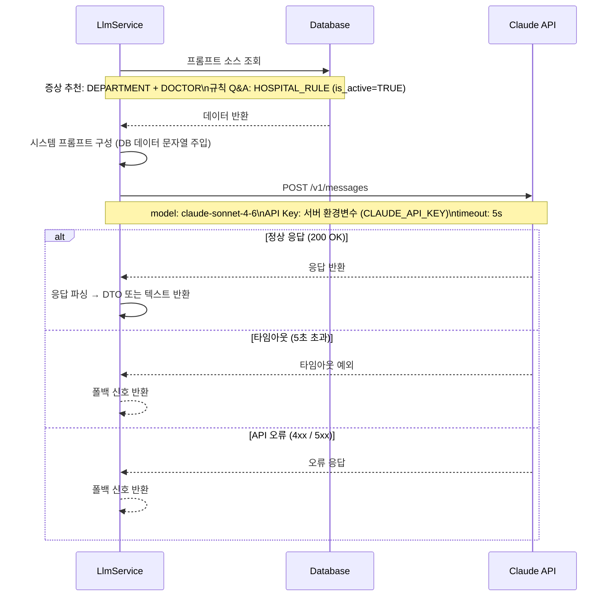

### 14.3 API Key 보안 원칙

```
브라우저 → Spring Boot 서버 → Claude API

규칙:
  ✅ API Key는 서버 환경변수로만 관리
  ✅ LlmService 내부에서만 Claude API 호출
  ❌ 브라우저에서 Claude API 직접 호출 금지
  ❌ application.properties에 API Key 하드코딩 금지
  ❌ Git 저장소에 API Key 커밋 금지 (.gitignore 등록 필수)

설정:
  # application.properties
  claude.api.key=${CLAUDE_API_KEY}

  # 서버 환경변수 설정 (Linux)
  export CLAUDE_API_KEY=sk-ant-xxxx
```

---

## 📌 설계 시 주요 고려 사항

**PRG 패턴 전면 적용**
모든 `POST` 처리 성공 후 반드시 `redirect:`를 반환한다. 새로고침 중복 제출 방지가 목적이다. 오류 시에만 폼 재렌더링을 사용한다.

**상태 전이 검증 위치**
상태 변경은 화면 버튼 제어만으로 막지 않고, 반드시 Service 레이어에서 이전 상태를 검증한다. 잘못된 전이 시도 시 `INVALID_STATUS_TRANSITION` 예외 발생.

**중복 예약 이중 방어**
Service 레이어에서 사전 조회로 명확한 오류 메시지를 반환하고, DB UNIQUE 제약 `(doctor_id, reservation_date, time_slot)`이 최후 방어선을 담당한다.

**방문 접수 트랜잭션**
`Patient` 저장 + `Reservation` 저장을 반드시 `@Transactional`로 묶는다. Patient 저장 후 Reservation 저장 실패 시 Patient도 롤백.

**TreatmentRecord + Reservation 트랜잭션**
진료 완료 처리 시 `TreatmentRecord` 저장 + `Reservation.status = COMPLETED` 변경은 반드시 하나의 `@Transactional` 내에서 처리한다.

**LLM 폴백 처리 필수**
증상 추천 실패 시 사용자 예약 흐름이 끊기지 않도록 직접 선택 화면으로 자연스럽게 전환한다. 규칙 챗봇 실패 시 관리자 문의 안내를 표시한다.

**LLM 면책 고지 필수**
증상 추천 결과 화면에는 `disclaimer` 문구를 반드시 표시한다. Mustache 템플릿 조건부 렌더링으로 누락 방지.

**RESERVATION.source 컬럼 활용**
모든 예약 생성 시 유입 경로를 `source` 컬럼에 기록한다. `ONLINE`(비회원 직접/LLM 추천), `PHONE`(전화 예약), `WALKIN`(방문 접수) 세 가지 값을 사용한다. 관리자 화면에서 source별 필터링을 지원한다.

---

_본 문서는 프로젝트 계획서 v4.2, ERD v3.0, 화면 정의서 v2.0, API 명세서 v4.0을 기반으로 작성되었습니다._
_변경 발생 시 GitHub Wiki에서 버전 이력을 관리합니다._
